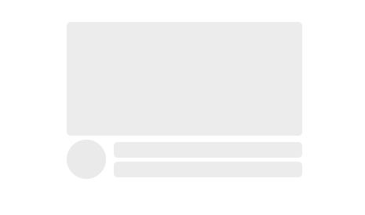

# react-components

## 1. Loading


```javascript
import { Loading } from "./components/index";

const colors = ["#8dc8fc", "#cdeb60", "#fca78d"];

const App = () => {
  return <Loading number={4} colors={colors} />;
};
```

## 2. Skeleton



```javascript
import { Skeleton, Circle, Rectangle } from "./components/index";

const SkelDiv = styled.div`
  display: flex;
  flex-flow: row nowrap;
  row-gap: 10px;
  justify-content: space-between;

  & .text-skel {
    display: flex;
    flex-flow: column nowrap;
    justify-content: center;
    row-gap: 5px;
  }
`;

const App = () => {
  return (
    <Skeleton width="300px" height="200px" animation="blink">
      <Rectangle width="300px" height="200px" />
      <SkelDiv>
        <Circle radius="50px" />
        <div className="text-skel">
          <Rectangle width="240px" height="20px" />
          <Rectangle width="240px" height="20px" />
        </div>
      </SkelDiv>
    </Skeleton>
  );
};
```

## 3. Modal

```javascript
import { Modal } from "./components/index";

const root = ReactDOM.createRoot(document.getElementById("root"));
root.render(
  <Modal width="300px" height="400px">
    <App />
  </Modal>
);
```
```javascript
import { useModal } from './components/index';

function App() {
  const openModal = useModal();

  return (
    <div className='main'>
      <button onClick={() => openModal(<p>this is Modal.</p>)}>open</button>
    </div>
  );
}
```